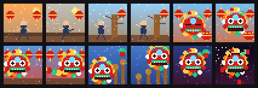

# Carousel demo — "The Awakening Lion of Foshan"

A 12-scene animated legend rendered as 32×32 pixel art, one GIF per **on-device carousel
slot**, so the iDotMatrix loops the whole story **autonomously** (no host connected). A Foshan
(佛山) tale — the martial-arts home of Wing Chun and the Southern Lion — following a kung fu
student from dawn training to the lion-dance climax of 采青 (*cai qing*, "plucking the greens").

| slot | scene | beat |
|---|---|---|
| 0 | train-horse | wide horse stance at sunrise |
| 1 | train-kick | a high kick |
| 2 | dummy-strike | striking the wooden dummy (木人桩) |
| 3 | dummy-flurry | a fast flurry |
| 4 | lion-asleep | the festival lion head (醒狮), eyes closed |
| 5 | lion-awake | it wakes — mouth open, mane shaking |
| 6 | dance-weave | the lion dance weaves the lantern-lit street |
| 7 | dance-leap | a big sway/leap to the drums |
| 8 | poles-climb | onto the plum-blossom poles (梅花桩) |
| 9 | poles-reach | reaching for the green hung up high |
| 10 | the-green | the green hangs, lion gathering below |
| 11 | cai-qing | pluck the greens, fireworks, red packets fall |



## Generate

```bash
python generate.py        # writes ./gifs/slot_00_*.gif … slot_11_*.gif  (~0.4 MB total)
```

Pure-procedural pixel art (PIL only) — no assets. Each scene is 48 frames at 70 ms with drifting
embers/confetti, ~36 KB encoded.

## Put it on the panel (carousel store)

**The device carousels exactly 12 slots** — `image_index` 0–11. (The app's "3 pages of 12" are
*app-side* sets you push one at a time; pushing a page **replaces** the 12 on the device. Indices
12 and 13 are the reserved *live* / *preview* buffers, not storage.) Each scene is stored with the
normal **GIF** chunked upload with two header fields (see
[`../../docs/PROTOCOL.md`](../../docs/PROTOCOL.md) → *Device carousel*):

- `image_index` = the **slot 0–11** — so scene order == story order,
- `timeSign` = the per-scene **dwell seconds** (≈4 s here).

Send the `cmd 2/1` slot-setup (`material_wipe`) once, then the 12 GIF uploads, then
`enter_asset_view` (`cmd 10/1`) to start the loop.

## Notes on limits (measured on hardware)

There is **no app-side size cap** — the device firmware rejects overflow with a `NO_SPACE` NAK,
which never fired here. A single slot accepted **≥1.3 MB**, so per-slot storage is *not* the
bottleneck; BLE upload time/reliability is. The 12-scene set (~0.4 MB, ~48 s of distinct animation)
loops forever, untethered.
