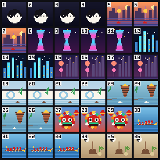

# Carousel demo — "A Grand Tour of China" (36 scenes)

36 animated 32×32 pixel-art scenes touring China, looping on the iDotMatrix **autonomously**.

The catch: **the device carousels only 12 slots** (a firmware hard cap — see
[`../../docs/PROTOCOL.md`](../../docs/PROTOCOL.md) → *Device carousel*). So this packs **3 scenes
into each slot's GIF** → 12 GIFs, 36 scenes. Each slot holds ≥1.3 MB, so a 3-scene ~48-frame GIF
(~30 KB) is trivial. Every scene is stamped with its number **1–36** (top-left).

| scenes | theme |
|---|---|
| 1–4 | ☯ Yin/Yang (rotating taiji) |
| 5–7 | 🌆 Guangzhou (Pearl River skyline) |
| 8–11 | 🗼 Canton Tower (色 the twisty 小蛮腰) |
| 12–14 | 🌃 Shenzhen (neon skyline, Ping An) |
| 15–18 | 🟣 Shanghai (Oriental Pearl + the Bund) |
| 19–22 | 🏯 Suzhou (moon gate, white walls, willows, canal) |
| 23–26 | ⛩ West Lake (Leifeng Pagoda, willows, boat) |
| 27–29 | 🦁 Foshan (lion dance) |
| 30–33 | 🐉 Dragon Boat (paddlers + drum) |
| 34–36 | 🌿 TCM (mortar & pestle, herbs, bagua) |



## Generate + store

```bash
python generate.py        # writes ./gifs/slot_00.gif … slot_11.gif (12 packed GIFs, ~0.37 MB)
```

Store each GIF to `image_index` 0–11 (`DataType.GIF`) with **`timeSign` ≈ 10 s** so each slot's
3-scene trio plays through before the carousel advances; then `enter_asset_view` (`cmd 10/1`).
Full loop ≈ 2 minutes, all 36 scenes, no host connected.

> Packing 3-per-slot is the workaround for the 12-slot cap. Push the dwell to 30 s if your
> firmware plays GIFs slower and a trio gets cut off.
