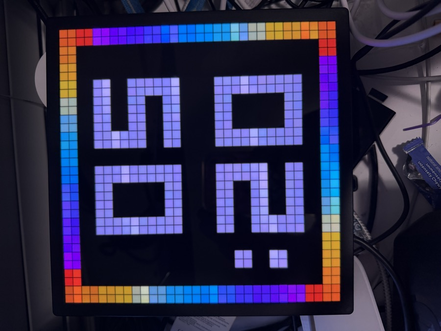
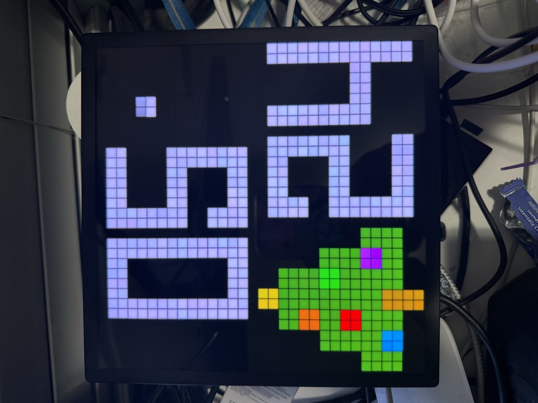
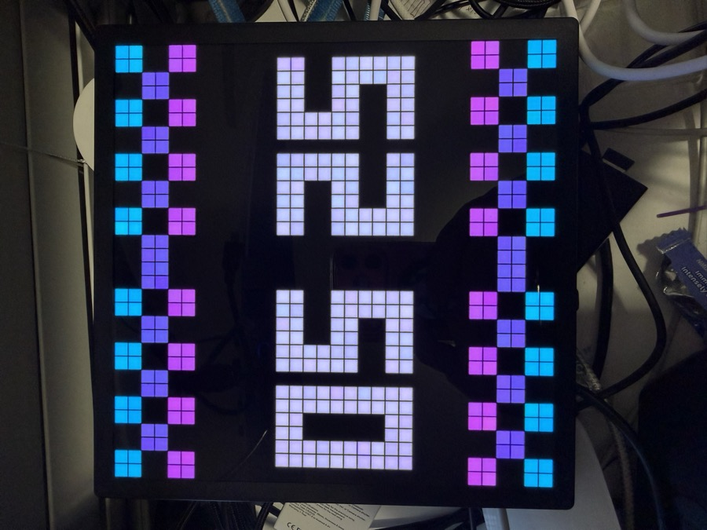
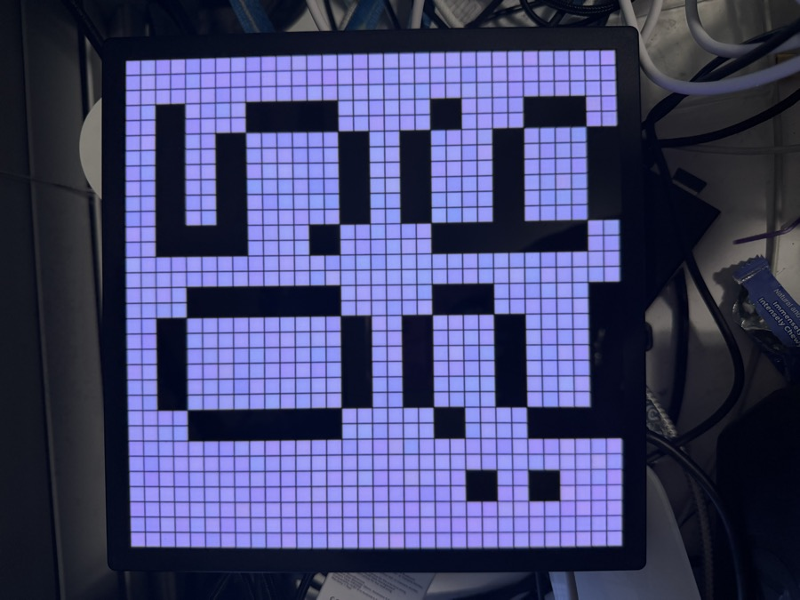
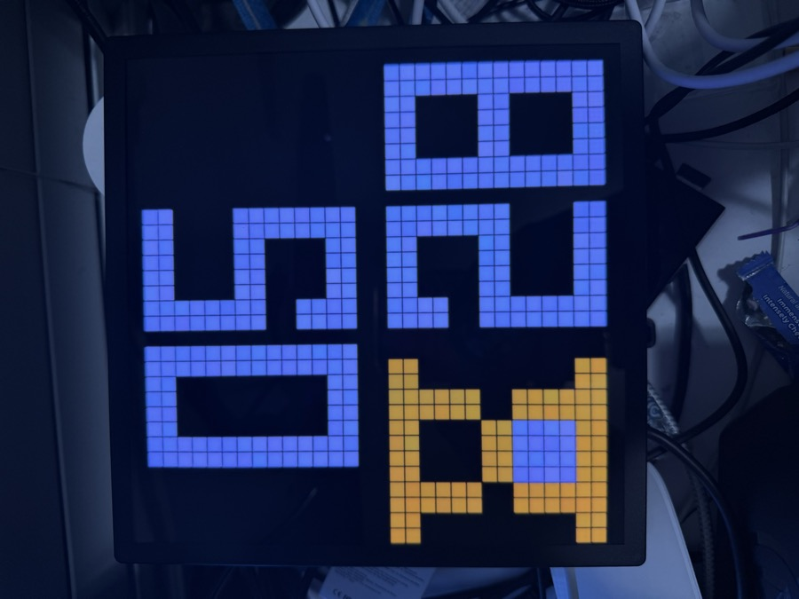
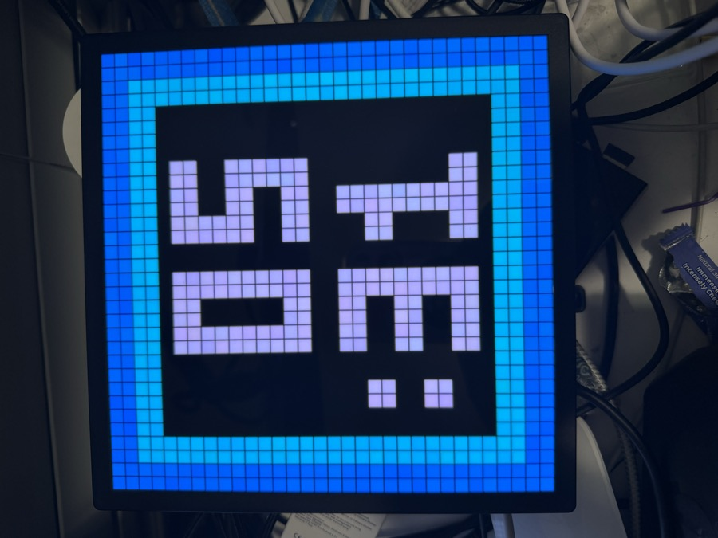
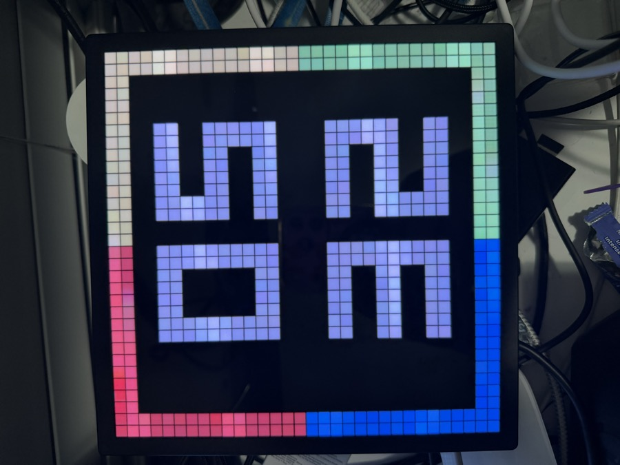

# iDotMatrix 32×32 — clock face styles

The clock command (`cmd 6/1`, `set_clock(style, show_date, hour24, r, g, b)`) has **8 built-in
styles**, selected by the `style` value `0–7` (low bits of byte[4]). They have **no names** in the
app — you pick them by appearance from a swipe carousel. The chosen **color swatch recolors the
digits**; each style's frame/icon decoration is fixed. Photos below are wire `style N` with white
digits (`set_clock(N, show_date=False, hour24=True, r=255, g=255, b=255)`).

> Wire `style N` == app preview position `#(N+1)`. (Note: if a `set_clock` is the very first frame
> after a fresh connect it can be dropped — send it twice, or after any other command.)

| wire `style` | app # | look | frame |
|:---:|:---:|---|---|
| 0 | 1 | **Rainbow border** — animated rainbow edge | `0800060140` + rgb |
| 1 | 2 | **Christmas tree** — ornamented green tree, lower-left | `0800060141` + rgb |
| 2 | 3 | **Checkered bands** — magenta/cyan X-pattern top & bottom (time side-by-side) | `0800060142` + rgb |
| 3 | 4 | **Filled / inverted** — solid colour fill, digits cut out | `0800060143` + rgb |
| 4 | 5 | **Hourglass** — yellow hourglass icon, lower-left | `0800060144` + rgb |
| 5 | 6 | **Alarm-clock frame** — blue rounded border w/ top notch | `0800060145` + rgb |
| 6 | 7 | **Blue gradient border** — thick concentric-blue square frame | `0800060146` + rgb |
| 7 | 8 | **Corner-gradient border** — thin red/blue/green/purple edge | `0800060147` + rgb |

(byte[4] also ORs `0x80`=show-date and `0x40`=24-hour; e.g. style 4 + 24h = `0x44`.)

## Style 0 — Rainbow border

## Style 1 — Christmas tree

## Style 2 — Checkered bands

## Style 3 — Filled / inverted

## Style 4 — Hourglass

## Style 5 — Alarm-clock frame

## Style 6 — Blue gradient border

## Style 7 — Corner-gradient border

