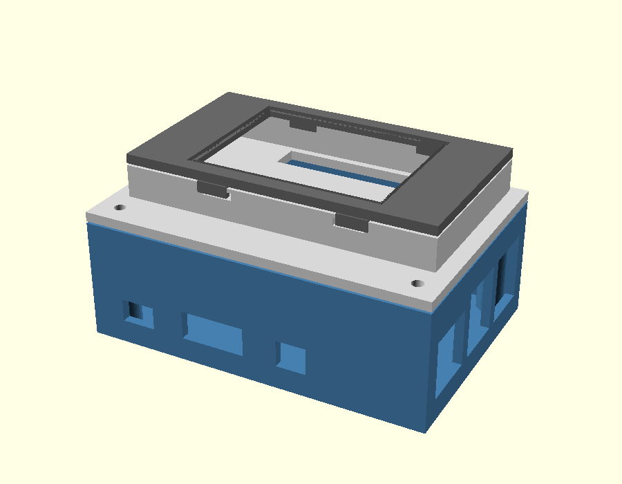

# Pi 3B+ + 2.4" TFT dashboard case

Parametric 3-part enclosure: a Raspberry Pi 3B+ box with a **face-up 2.4" SPI TFT** (ILI9341/XPT2046)
in a top bay. The screen is wired to the Pi GPIO by **jumpers** — its header pins point down through a
slot in the lid into the Pi compartment. Defaults are for the **77×43 "red board" MSP2402** module.



## Parts (all export manifold / watertight)
| Part | STL | Notes |
|---|---|---|
| Base box | `base.stl` | Pi on 4× M2.5 standoffs; port cutouts; vents; corner bosses for the lid screws |
| Bay-tray lid | `lid.stl` | screws to the base; raised bay well for the screen; header pass-through slot; SD/touch relief pocket |
| Snap bezel | `bezel.stl` | window over the active area (+1 mm reveal), chamfered edge; snap tabs into the well |

## Assembly
1. Pi onto the base standoffs (M2.5 self-tappers, or push-fit).
2. Run 14 female-female Dupont jumpers from the Pi GPIO up through the lid's header slot.
3. Drop the screen face-up into the bay; plug the jumpers onto its header (pins point down).
4. Snap the bezel on. Screw the lid to the base (4× M2.5 into the corner bosses).
See `../../prompt2panel/research/tft-touch-feasibility.md` for the GPIO pin mapping.

## ⚠️ Re-measure before printing (only two params matter)
Modules vary. Caliper your board and, if different, edit the top of `case.scad`:
- `tft_l`, `tft_w`, `tft_t` (PCB size / thickness) — default 77.18 × 42.72 × 7.0
- the header's offset along its edge, and the glass/active-area offset (affects `bezel` window centering)

**Print a test coupon first** (bay corner + header slot + a snap tab) to confirm the fit before the
full base.

## Print notes
- Orientation: base open-side-up, lid bay-up (as modeled), bezel face-down. No supports needed if you
  add 45° chamfers/bridges over the port cutouts (or print with tree supports on the ports only).
- Tolerances: PCB pocket has +0.4 mm (`fit`), snaps +0.25 mm (`snap_clr`). M2.5 self-tap pilots 2.1 mm
  (bump to 3.5 mm bores if you use heat-set inserts).
- Filament: PETG preferred (cases run warm); PLA fine for a desk unit. 0.2 mm layers, 3 perimeters.

## Regenerate
```bash
OSCAD=/Applications/OpenSCAD.app/Contents/MacOS/OpenSCAD   # or `openscad` on Linux
for p in base lid bezel; do $OSCAD -o $p.stl -D "part=\"$p\"" case.scad; done
$OSCAD -o assembled_iso.png --viewall --autocenter --camera=0,0,0,62,0,28,0 -D 'part="assembled"' case.scad
```
Everything is parametric — a re-measure is a one-line change at the top of `case.scad`.
